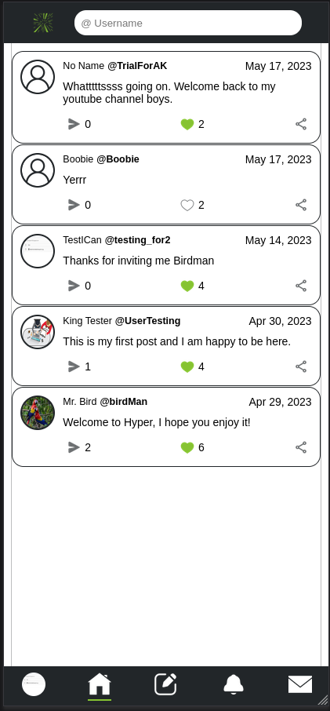
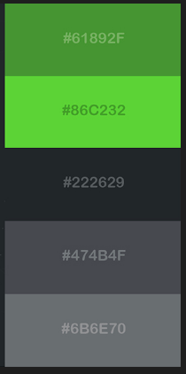

# Hyper React App

A recreation of Twitter using, HTML, CSS, React, React Router and Firebase. This app is my first attempt at a fully functioning

## Project: Javascript Final Project

The project is from The Odin Project [curriculum](https://www.theodinproject.com/lessons/node-path-javascript-javascript-final-project), or see the Assignment section below.

A **live preview** of the project is [here](https://lucasstinson.github.io/hyper/).

### Overview

#### **Landing Page**

 
 

#### **Color Palette**

 
 

#### **Features/Directions:**

- Welcome to Hyper, where you can join in on public posts,ongoing discussions and interact directly with other users.
- The landing page of Hyper is the town square where you can see posts from all users.
- A user has the ability to create an account or just be a fly on the wall and watch the ongoing conversations.
  - Create your account using an email, password and username. (Don't worry this can be a made up email as a verification email is not required).
  - Logging in only requires your email and password
- Most actions are only available to a logged in user and is recommended for the full experience.
- Once you are logged in you have the ability to update your profile by clicking on the generic person silhouette. This will take you to the profile page. You can then click the "Edit profile" to reach the settings. The following can be updated:
  - Your profile picture.
  - Your nickname.
  - Your bio.
- You can "shout" from any page by clicking the notepad symbol in the middle of the nav bar to display the text box.
  - Only 200 characters are allowed for each "shout".
  - The messaged will be pinned to the homepage.
  - Each post can be viewed, liked, or shared.
- A post has multiple ways for a user to interact with it.
- Each post displays user identifying information, the text of the post, the comment count (arrow), likes (heart) and allows a user to quickly copy the path to the post thread.
- A user can click the image or user's names to go to their profile.
- A user can click the post or comment emoji to go to the thread related to that post.
- If you navigate to another user's profile, you have the ability to follow or direct message a user.
  - Following a user is real time
  - Clicking the message button will generate a chatroom between you and that user.
- A post thread allows users to directly comment on what was posted by clicking the "Add a comment" button. This will then generate those comments underneath the post.
- Any time a user interacts with your account such as commenting on your post, liking your post or following you then you will recieve a notification.
  - A notification count will appear on the notification emoji (bell) in the nav bar.
- Clicking the notification emoji will allow you to see all your notifications. Each notification will direct you to the interaction.
  - Clicking a like will take you to the post they liked.
  - Clicking a follow will take you to the user's profile.
  - Clicking a comment will take you to the post thread they commented on.
- A user is able to directly message other user's. When a user messages you a notification will appear on the messages emoji (envelope). Once a conversation is started they will always exist on the messages page. This can be reached by clicking the message emoji.
  - You will see a list of conversations for each one.
  - If a conversation is gray, then it has unread messages.
  - Clicking a conversation will take you to the direct messages/ chatroom
- In the direct messages, you can have your private conversation with the other user.

#### **Tools:**

 
 

#### **Areas of Improvement:**

-

### Assignment

Replicate your favorite website as close as possible - Pinterest, Facebook, Twitter, etc.

1. Set up a GitHub Repo for this project. Follow the instructions in [Git basics](https://www.theodinproject.com/paths/foundations/courses/foundations/lessons/git-basics) if you need help.
2. Think about what you need to do. It's really helpful to write your plan down on paper or whiteboard ahead of time! A few hours of thought now will save you days of coding. Try to lay it ALL out. An important part of planning is **scope**. You obviously can't build the entire website (which presumably took a full team of engineers years to produce), so you'll need to identify the site's core functionality and the "nice-to-have" stuff. **Make sure you finish the core functionality BEFORE working on the rest.** If you try to do everything at once, you'll get lost and frustrated. Trust us. Everything takes longer than you expect.
3. Roll up your sleeves and start building!
4. Try to test the high-level functionality using a suitable testing library, for example, Javascript with Jest or Rails with RSpec. Don't get too bogged down in testing, but try and save yourself time by adding high-level tests, so you don't need to click around 100 times every time you make a change to something that seems important.
5. Once you finish, push to GitHub and definitely submit your project below!

